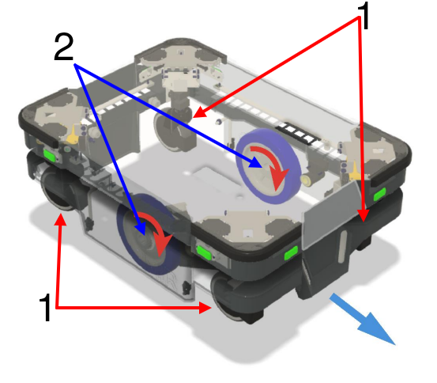
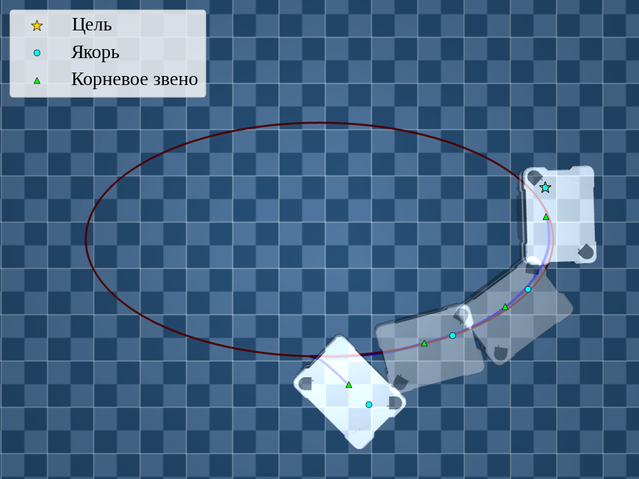
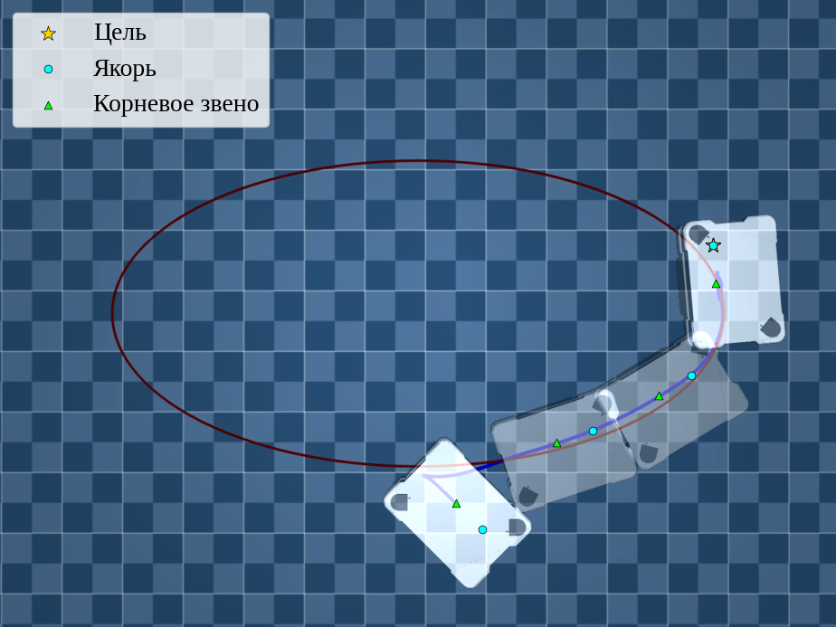
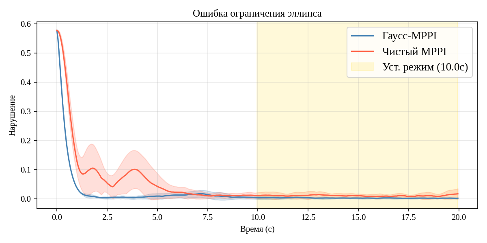
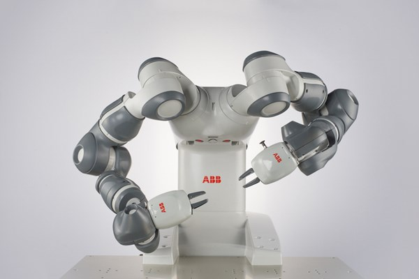
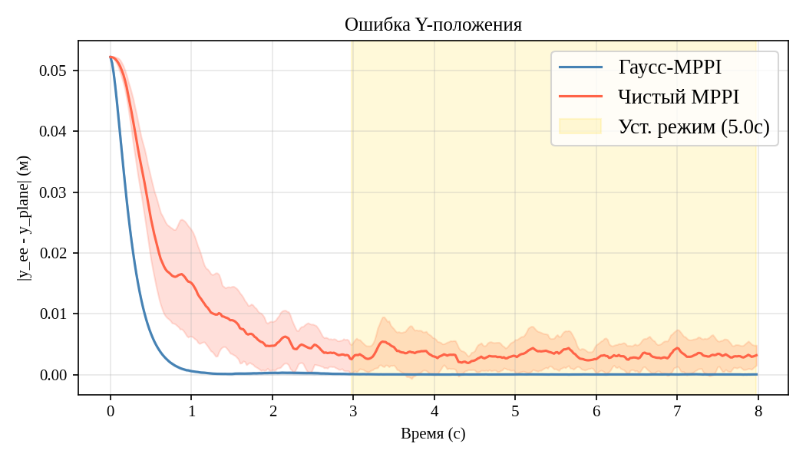
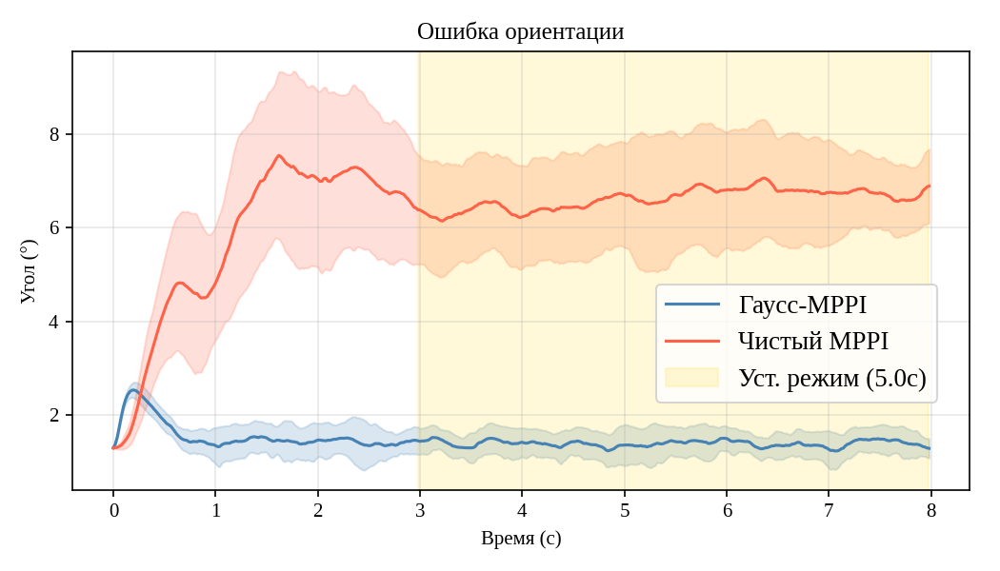
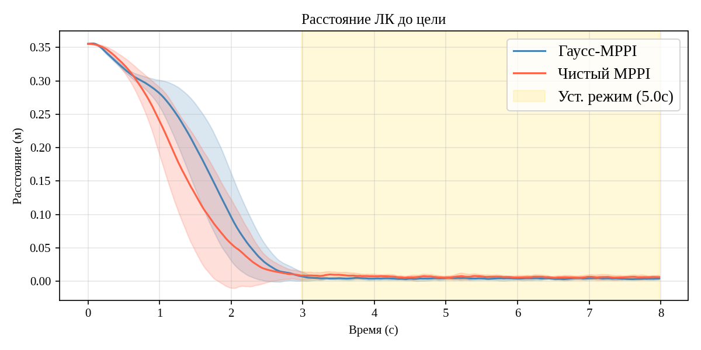
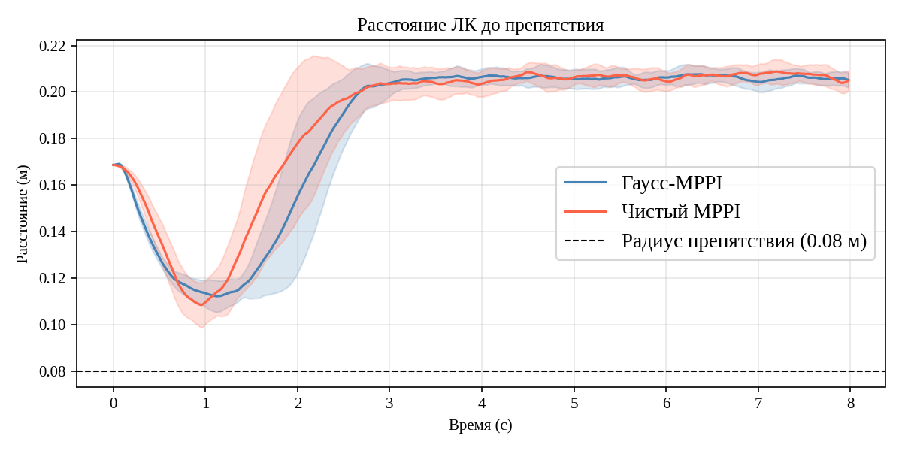

## Постановка задачи

::::: {.columns}
:::: {.column width="48%"}
* В робототехнике многие задачи содержат **жёсткие ограничения-равенства** --- система обязана точно оставаться на многообразии

* [Примеры:]{style="color:green;"}
  * движение точно по заданной кривой
  * замкнутая кинематическая цепь у двуруких рук
  * неголономное качение колёс
::::

:::: {.column width="52%"}
::: {#fig-intro style="text-align:center;"}
<video data-autoplay controls loop muted playsinline width="660" height="371" src="videos/intro_example.mp4"></video>

Совместный захват жёсткого объекта двумя руками
:::
::::
:::::

## Постановка задачи: MPPI и его недостатки

::::: {.columns}
:::: {.column width="48%"}
* **MPPI** (Model Predictive Path Integral) [@Williams2017MPPI] --- метод предиктивного управления на основе семплирования

::: {.fragment .fade-up}
* [Проблема:]{style="color:red;"} нет встроенного механизма обработки ограничений
:::

::: {.fragment .fade-up}
* [Ключевая сложность равенств:]{style="color:green;"} случайные возмущения управления имеют **нулевую вероятность** попасть на многообразие нулевой меры $\mathcal{M} = \{\mathbf{x} : h(\mathbf{x}) = 0\}$
:::
::::

:::: {.column width="52%"}
::: {#fig-mppi-demo style="text-align:center;"}
<video data-autoplay controls loop muted playsinline width="660" height="371" src="videos/mppi_demo.mp4"></video>

MPPI, навигация среди движущихся препятствий
:::
::::
:::::

##  Постановка задачи: Формально

::::: {.columns}
:::: {.column width="50%"}
::: {.fragment .fade-up}
**Система.** Состояние $\mathbf{x} = (\mathbf{q}, \mathbf{v})$ из обобщённых координат и скоростей, динамика
$$
\mathbf{M}(\mathbf{q})\,\dot{\mathbf{v}} = \mathbf{n}(\mathbf{q}, \mathbf{v}) + \mathbf{B} \mathbf{u}(t)
$$
:::

::: {.fragment .fade-up}
**Ограничения-равенства** задают допустимое многообразие
$$
h_i(\mathbf{q}, \mathbf{v}, t) = 0, \quad i = 1, \dots, m
$$
$$
\mathcal{M} = \{\mathbf{x} : h(\mathbf{x}, t) = 0\}
$$
:::
::::

:::: {.column width="50%"}
::: {.fragment .fade-up}
**Задача оптимального управления:**
$$
\begin{aligned}
    \min_{\mathbf{u}} \quad & S(\tau, \mathbf{u}, 0, T) \\
    \text{s.t.} \quad & \mathbf{M}(\mathbf{q})\,\dot{\mathbf{v}} = \mathbf{n}(\mathbf{q}, \mathbf{v}) + \mathbf{B} \mathbf{u}(t) \\
                      & h_i(\mathbf{q}, \mathbf{v}, t) = 0
\end{aligned}
$$
со стоимостью траектории
$$
S(\tau) = \phi(\tau(t_e)) + \int_0^T \!\big[\psi(\tau) + \tfrac{1}{2}\mathbf{u}^T\mathbf{R}\,\mathbf{u}\big]\,dt
$$
:::
::::
:::::

<!--
## Литературный обзор {.smaller}

| Семейство методов | Механизм | Равенства |
|---|---|---|
| Shield/GS/BR-MPPI, DBaS | барьерные функции, $h(\mathbf{x}) \geq 0$ | косвенно, коридор $\|h\| \leq \varepsilon$ |
| BC/RA/BSS/TD-CD-MPPI | штраф и перевзвешивание | мягкое смещение |
| MPPI-IPDDP, CSVTO | коридор + оптимизатор | да, но **офлайн** |
| CSMPC | Лагранж + проекция | да, но **линейные** |

::: {.fragment .fade-up}
[Вывод:]{style="color:red;"} ни один метод не обеспечивает асимптотическую сходимость $h(\mathbf{x}) \to 0$ для **общих нелинейных** равенств в замкнутом контуре.
:::

::: {.fragment .fade-up}
[Пробел:]{style="color:green;"} принцип наименьшего принуждения Гаусса [@UdwadiaKalabaApproach] даёт аналитическую проекцию ускорений на множество допустимых --- но с современным семплированным управлением не соединялся.
:::
-->

## Предварительные сведения: MPPI

* Стохастическая динамика: $d\mathbf{x} = [\mathbf{f} + \mathbf{B}\,\mathbf{u}]\,dt + \mathbf{G}\,d\mathbf{w}$

* Стоимость: $S(\tau) = \phi(\tau(t_e)) + \int_{t_s}^{t_e} \big[\psi(\tau) + \tfrac{1}{2}\mathbf{u}^T \mathbf{R}\,\mathbf{u}\big]\,dt$

::: {.fragment .fade-up}
* Возмущения $\delta\mathbf{u} \sim \mathcal{N}(0, \Sigma)$; оптимальное управление --- взвешенное по важности среднее [@Williams2017MPPI]:

$$
\mathbf{u}^*(t) = \mathbf{u}_n(t) + \frac{\mathbb{E}_q\!\big[\exp(-\tfrac{1}{\lambda}\tilde{S}(\tau))\,\delta\mathbf{u}\big]}{\mathbb{E}_q\!\big[\exp(-\tfrac{1}{\lambda}\tilde{S}(\tau))\big]}
$$
:::

::: {.fragment .fade-up}
* Аппроксимация Монте-Карло по $K$ параллельным прогонам с весами $\omega_k = \exp(-\tfrac{1}{\lambda}(\tilde{S}_k - \min_j \tilde{S}_j))$
:::

## Литературный обзор: барьерные функции и состояния {.smaller}

Барьеры (CBF [@Ames2017CBF]) и барьерные состояния (DBaS) делают допустимое множество положительно-инвариантным --- но через односторонние неравенства $h(\mathbf{x}) \geq 0$:

- **Shield-MPPI** [@ShieldMPPI] --- CBF-фильтр безопасности постобработкой (расширяет CBF--MPPI [@TaoCBFMPPI])
- **GS-MPPI** [@GSMPPI] --- композитный CBF встроен в динамику прогонов
- **BR-MPPI** [@BRMPPI] --- CBF-равенства на параметр скорости + проекция
- **MPPI-DBaS** [@MPPIDBaS], **DBaS-Log-MPPI** [@DBaSLogMPPI] --- дискретные барьерные состояния

::: {.fragment .fade-up}
Равенства --- лишь [коридор]{style="color:red;"} $\|h\| \leq \varepsilon$ через двойной барьер; при $\varepsilon \to 0$ численно неустойчив, сходимости нет.
:::

## Литературный обзор: штраф и перевзвешивание {.smaller}

Смещение семплирования к $\mathcal{M}$ через манипуляцию стоимостью:

- **BC-MPPI** [@BCMPPI] --- байесовский суррогат вероятности допустимости
- **RA-MPPI** [@RAMPPI] --- условная мера риска CVaR
- **BSS-MPPI** [@BSSMPPI] --- вероятностные ограничения в пространстве убеждений
- **TD-CD-MPPI** [@TDCDMPPI] --- модуляция коэффициента дисконтирования по нарушению

::: {.fragment .fade-up}
Остаточное нарушение зависит от веса штрафа, числа выборок и $\lambda$ --- [ни границы, ни сходимости]{style="color:red;"}.
:::

<!-- ## Литературный обзор: другие подходы {.smaller}

- **Tube-MPPI** [@TubeMPPI] --- управление ковариацией в «трубке», только **линейная** динамика
- **MPPI-IPDDP** [@MPPIIPDDP] --- коридор + IPDDP, $\|h\| \leq 10^{-6}$, но **офлайн**
- **π-MPPI** [@piMPPI] --- проекционный фильтр в пространстве **управления**
- **o-MPPI** [@oMPPI] --- семплирование в пространстве состояний

::: {.fragment .fade-up}
Архитектурно идея проекции на $\mathcal{M}$ применима, но для общих равенств [не продемонстрирована]{style="color:red;"}.
::: -->

## Литературный обзор: ближе всего к равенствам {.smaller}

Методы, обеспечивающие $h(\mathbf{x}) = 0$ с точностью решателя:

- **CSVTO** [@CSVTO] --- SVGD с ограничениями, работает с многообразиями нулевой меры, но **офлайн** и вычислительно дорого
- **CSMPC** [@WangCSMPC] --- иерархическая оптимизация Лагранж + проекция, равенства **в реальном времени**, но лишь для **линейных** ограничений

::: {.fragment .fade-up}
[Вывод:]{style="color:red;"} ни один метод не обеспечивает асимптотическую сходимость $h(\mathbf{x}) \to 0$ для **общих нелинейных** равенств в замкнутом контуре --- лишь коридор, офлайн-подпрограмма или линейный случай.
:::

## Ключевая идея: два слоя ограничений

::::: {.columns}
:::: {.column width="50%"}
::: {.fragment .fade-up}
[Физические ограничения]{style="color:blue;"} $h_\text{phys}$

* свойства самой механики системы
* неголономное качение, замкнутые цепи, контакты
* **встраиваются в динамику** объекта управления
:::
::::

:::: {.column width="50%"}
::: {.fragment .fade-up}
[Функциональные ограничения]{style="color:green;"} $h_\text{task}$

* требования миссии
* следование по кривой, удержание в плоскости
* **проекция управления на ядро cкорректированной матрицы функционального ограничения**
:::
::::
:::::

::: {.fragment .fade-up}
Каждый слой обрабатывается отдельным проекционным оператором, применяемым последовательно вокруг стандартного цикла MPPI.
:::

## Архитектура Гаусс-MPPI

```{mermaid}
%%| label: fig-arch
%%| fig-cap: "Архитектура управления Гаусс-MPPI: два проекционных слоя вокруг цикла MPPI"
%%| fig-width: 11
%%{init: {"themeVariables": {"fontSize": "28px"}}}%%
flowchart LR
    M["$$\begin{gathered}\text{Измерение} \\\\ \mathbf{x}\end{gathered}$$"] --> S["$$\begin{gathered}\text{MPPI} \\\\ \text{семплирование}\end{gathered}$$"]
    S -->|"$$\mathbf{u},\ S$$"| T["$$\begin{gathered}\text{Функц. проекция} \\\\ \mathbf{u}_c = \mathbf{N}\mathbf{u} + \mathbf{W}^{+}\boldsymbol{\varepsilon}\end{gathered}$$"]
    T -->|"$$\mathbf{u}_c$$"| P["$$\begin{gathered}\text{Физ. проекция} \\\\ \hat{\boldsymbol{\Phi}},\ \boldsymbol{\beta}\end{gathered}$$"]
    P -->|"$$\dot{\mathbf{v}}$$"| U["$$\begin{gathered}\text{MPPI} \\\\ \text{обновление}\end{gathered}$$"]
    U -->|"$$\mathbf{u}_c^{*}$$"| PL["$$\begin{gathered}\text{Объект управления} \\\\ \mathbf{M}\dot{\mathbf{v}} = \mathbf{n} + \mathbf{B}\mathbf{u} + \mathbf{n}_c\end{gathered}$$"]
    PL --> M
    style T fill:#ffe5cc,stroke:#cc7a00
    style P fill:#e6f0ff,stroke:#0047b3
    style S fill:#e2f7e2,stroke:#00740e
    style U fill:#e2f7e2,stroke:#00740e
    style PL fill:#dce8ff,stroke:#0047b3
```

* Физические ограничения встроены в динамику через $\mathbf{n}_c$; функциональные исключены из пространства управления. Вероятностная машинерия MPPI не тронута.

## Принцип наименьшего принуждения Гаусса

* Динамика: $\mathbf{M}(\mathbf{q})\,\dot{\mathbf{v}} = \mathbf{n}(\mathbf{q}, \mathbf{v}) + \mathbf{u}(t)$

::: {.fragment .fade-up}
* Задача квадратичного программирования:
$$
\begin{aligned}
    \min_{\dot{\mathbf{v}}} \quad & [\dot{\mathbf{v}} - \mathbf{a}]^T \mathbf{M}\,[\dot{\mathbf{v}} - \mathbf{a}] \\
    \text{s.t.} \quad & \mathbf{A}\,\dot{\mathbf{v}} = \mathbf{b}
\end{aligned}
$$
где $\mathbf{a} = \mathbf{M}^{-1}(\mathbf{n} + \mathbf{u})$ --- свободное ускорение
:::

::: {.fragment .fade-up}
* Решение Удвадия--Калабы [@UdwadiaKalabaApproach] --- сила реакций связей:
$$
\mathbf{n}_c = \mathbf{M}^{1/2}(\mathbf{A}\,\mathbf{M}^{-1/2})^{+}(\mathbf{b} - \mathbf{A}\,\mathbf{M}^{-1}(\mathbf{n} + \mathbf{u}))
$$
:::

::: {.fragment .fade-up}
$\Rightarrow$ естественный способ наложить ограничения-равенства на уровне динамики
:::

## Физический слой

* Разложение силы реакций $\mathbf{n}_c$ на проектор $\pmb{\Phi}$ и сдвиг $\pmb{\beta}$:
$$
\pmb{\Phi} = -\mathbf{M}^{1/2}[\mathbf{A}_\text{phys}\mathbf{M}^{-1/2}]^{+}\mathbf{A}_\text{phys}\mathbf{M}^{-1}, \quad
\pmb{\beta} = \mathbf{M}^{1/2}[\mathbf{A}_\text{phys}\mathbf{M}^{-1/2}]^{+}\mathbf{b}_\text{phys}
$$

::: {.fragment .fade-up}
* С $\hat{\pmb{\Phi}} = \mathbf{I} + \pmb{\Phi}$ ограниченное ускорение (с матрицей распределения $\mathbf{B}$ для систем с неполным приводом):
$$
\dot{\mathbf{v}} = \mathbf{M}^{-1}\big[\hat{\pmb{\Phi}}\,\mathbf{n} + \hat{\pmb{\Phi}}\,\mathbf{B}\,\mathbf{u} + \pmb{\beta}\big]
$$
:::

::: {.fragment .fade-up}
* Этот объект управления «видит» MPPI: $h_\text{phys}$ **никогда не нарушаются** во время семплирования
:::

## Функциональный слой

* Требование $\mathbf{A}_\text{task}\dot{\mathbf{v}} = \mathbf{b}_\text{task}$ даёт линейную систему по управлению $\mathbf{W}\,\mathbf{u} = \pmb{\varepsilon}$, где
$$
\mathbf{W} = \mathbf{A}_\text{task}\mathbf{M}^{-1}\hat{\pmb{\Phi}}\mathbf{B}, \qquad
\pmb{\varepsilon} = \mathbf{b}_\text{task} - \mathbf{A}_\text{task}\mathbf{M}^{-1}(\hat{\pmb{\Phi}}\mathbf{n} + \pmb{\beta})
$$

::: {.fragment .fade-up}
* Решение минимальной нормы --- проекция на ядро скоректированного функционального ограничения ($\mathbf{W}$):
$$
\mathbf{u}_c = \underbrace{(\mathbf{I} - \mathbf{W}^{+}\mathbf{W})}_{\mathbf{N}}\,\mathbf{u} + \mathbf{W}^{+}\pmb{\varepsilon}
$$
:::

::: {.fragment .fade-up}
* Проектор $\mathbf{N}$ оставляет MPPI лишь подпространство управлений, совместимое с $h_\text{task}$
:::

## Регуляризация Тихонова [@tikhonov1977]

* Вблизи кинематических сингулярностей $\mathbf{W}\mathbf{W}^\top$ становится сингулярной или плохо обусловленной --- ранг $\mathbf{W}$ падает, точная псевдообратная **численно взрывается**

::: {.fragment .fade-up}
* Псевдообратная с регуляризацией
$$
\mathbf{W}^{+} = \mathbf{W}^\top\,(\mathbf{W}\,\mathbf{W}^\top + \lambda_\text{reg}\,\mathbf{I})^{-1}
$$
* $\lambda_\text{reg} > 0$ --- малый коэффициент регуляризации (не путать с температурой MPPI $\lambda$)
:::

::: {.fragment .fade-up}
* При полном строчном ранге $\mathbf{W}$ и $\lambda_\text{reg} \to 0$ сводится к псевдообратной Мура--Пенроуза --- функциональные ограничения выполняются **точно**
:::

::: {.fragment .fade-up}
* Вдали от сингулярностей погрешность пренебрежимо мала; вблизи --- предотвращает взрыв ценой малой остаточной невязки (в симуляциях $\lambda_\text{reg} = 5\times 10^{-4}$)
:::

## Стабилизация Баумгарта [@baumgarte1972]

* Механизм работает на уровне ускорений ($\ddot{h} = 0$), но численное интегрирование вызывает **дрейф** на уровне положений

::: {.fragment .fade-up}
* Заменить $\ddot{h}=0$ критически демпфированной формой
$$
\ddot{h} + 2\alpha\,\dot{h} + \alpha^2\,h = 0
$$
:::

::: {.fragment .fade-up}
* Практически модифицируется смещение связи:
$$
\mathbf{b}_\text{stab} = \mathbf{b}_0 - 2\alpha\,\dot{h} - \alpha^2\,h
$$
* Обеспечивает асимптотическую сходимость $h(t) \to 0$ с настраиваемой скоростью $\alpha$
:::

## Алгоритм Гаусс-MPPI {.smaller}

В каждом прогоне на каждом шаге:

1. Вычислить $\hat{\pmb{\Phi}}, \pmb{\beta}$ (физический слой) и $\mathbf{W}, \pmb{\varepsilon}$ (функциональный слой)
2. Проекция на ядро: $\;\mathbf{u}_c \gets (\mathbf{I} - \mathbf{W}^{+}\mathbf{W})(\mathbf{u}_t + \delta\mathbf{u}_t^{(k)}) + \mathbf{W}^{+}\pmb{\varepsilon}$
3. Ограниченное ускорение: $\;\dot{\mathbf{v}} \gets \mathbf{M}^{-1}[\hat{\pmb{\Phi}}(\mathbf{B}\mathbf{u}_c + \mathbf{n}) + \pmb{\beta}]$
4. Накопить стоимость $\tilde{S}_k$, проинтегрировать состояние

::: {.fragment .fade-up}
Затем --- стандартное взвешенно-важностное обновление и сдвиг последовательности.

[Два изменения относительно MPPI:]{style="color:green;"} (i) ограниченная динамика прогонов; (ii) проекция номинального и выходного управления через функциональный слой. **Функция стоимости не меняется.**
:::

## Наследование гарантий MPPI

::: {.fragment .fade-up}
[Утверждение (корректность Гаусс-MPPI):]{style="color:green;"} при полном строчном ранге $\mathbf{W}$ последовательное применение двух проекций сводит задачу к стандартной (свободной от ограничений) задаче MPPI в координатах ядра $\pmb{\eta} = \mathbf{Z}^T\mathbf{u}$.
:::

::: {.fragment .fade-up}
* Сохраняется аффинная по управлению структура: $\dot{\mathbf{v}} = \tilde{\mathbf{f}} + \tilde{\mathbf{B}}\,\pmb{\eta}$
* Сохраняется квадратичность стоимости: $\tilde{\mathbf{R}} = \mathbf{Z}^T\mathbf{R}\mathbf{Z} \succ 0$
* Переносится теоретико-информационное условие Уильямса
:::

::: {.fragment .fade-up}
$\Rightarrow$ Гаусс-MPPI --- не эвристика, а **точное применение** MPPI к редуцированной задаче. Все гарантии оригинала наследуются автоматически.
:::

## Программная реализация

::::: {.columns}
:::: {.column width="60%"}
* Python + **MuJoCo MJX** [@todorov2012mujoco] + **JAX/XLA**
* Весь цикл MPPI (проекции Гаусса и на ядро) компилируется в единое XLA-ядро и распараллеливается по прогонам на GPU
* MuJoCo даёт аналитический доступ к $\mathbf{M}(\mathbf{q})$, $\mathbf{n}(\mathbf{q},\mathbf{v})$ и Якобианам
* Регуляризация Тихонова $\lambda_\text{reg} = 5\cdot 10^{-4}$
::::

:::: {.column width="40%"}
::: {.fragment .fade-up}
* [Оборудование:]{style="color:green;"}
  * Intel Core i7-9750H
  * NVIDIA GeForce GTX 1660 Ti
* Валидация --- две контрастные системы: неполнопривóдная и полнопривóдная.
:::
::::
:::::

## Симуляция 1: MiR 250 {.smaller}

::::: {.columns}
:::: {.column width="55%"}
* Мобильная платформа с дифф. приводом; 2 ведущих колеса + 4 пассивных ролика
* $n_q = 17$, $n_v = 16$, приводов $n_u = 2$ $\Rightarrow$ **неполный привод**

[Физические ограничения]{style="color:blue;"} ($m_\text{phys}=15$):

* качение без проскальзывания (6 колёс)
* планарность основания

[Функциональное ограничение]{style="color:green;"} ($m_\text{task}=1$):

* основание на эллипсе $\frac{(x-c_x)^2}{a^2} + \frac{(y-c_y)^2}{b^2} = 1$
::::

:::: {.column width="45%"}
{#fig-mir-scheme width=92%}
::::
:::::

## MiR 250: симуляция {.smaller}

::::: {.columns}
:::: {.column width="50%"}
::: {#fig-mir-sim-gauss style="text-align:center;"}
<video data-autoplay controls loop muted playsinline width="560" height="436" src="videos/mir_gauss.mp4"></video>

[Гаусс-MPPI]{style="color:green;"} --- следование по эллипсу
:::
::::

:::: {.column width="50%"}
::: {#fig-mir-sim-pure style="text-align:center;"}
<video data-autoplay controls loop muted playsinline width="560" height="436" src="videos/mir_pure.mp4"></video>

[Стандартный MPPI]{style="color:red;"} --- штрафы за невязку
:::
::::
:::::

* Цель не лежит на эллипсе: установившееся поведение --- компромисс «ближайшая точка эллипса + ориентация на цель»

<!-- ## MiR 250: траектории

::::: {.columns}
::: {.column width="50%"}
{#fig-mir-traj-gauss width=100%}
:::

::: {.column width="50%"}
{#fig-mir-traj-pure width=100%}
:::
::::: -->

## MiR 250: результаты

::::: {.columns}
:::: {.column width="55%"}
{#fig-mir-ellipse width=100%}
::::

:::: {.column width="45%"}
::: {.fragment .fade-up}
* Средняя ошибка эллипса в [**3.6 раза**]{style="color:green;"} меньше:
  $0.0031$ против $0.0111$
* Ст. отклонение втрое меньше --- выше повторяемость
* Позиционная стоимость на $\approx 30\%$ ниже
* Накладные расходы $\approx 16\%$ времени на шаг
:::
::::
:::::

## Симуляция 2: ABB YuMi {.smaller}

::::: {.columns}
:::: {.column width="58%"}
* Коллаборативный двурукий манипулятор, $7+7$ шарниров
* $n_q = n_v = 14$, **полный привод** ($\mathbf{B} = \mathbf{I}_{14}$)

[Физическое ограничение]{style="color:blue;"} ($m_\text{phys}=6$):

* замкнутая кинематическая цепь $\mathbf{T}_L^{-1}\mathbf{T}_R = \mathbf{T}_\text{rel}^{\star}$ (стабилизация на $SO(3)$ [@Milioshin2024UdwadiaKalaba])

[Функциональное ограничение]{style="color:green;"} ($m_\text{task}=2$):

* левый эффектор удерживается на вертикальной плоскости + ориентация

* препятствие --- мягкий штраф (неравенство вне метода)
::::

:::: {.column width="42%"}
{#fig-yumi-photo width=78%}
::::
:::::

## YuMi: симуляция, вид спереди

::::: {.columns}
:::: {.column width="50%"}
::: {#fig-yumi-front style="text-align:center;"}
<video data-autoplay controls loop muted playsinline width="500" height="389" src="videos/yumi_gauss_front.mp4"></video>

[Гаусс-MPPI]{style="color:green;"}
:::
::::

:::: {.column width="50%"}
::: {#fig-yumi-pure-front style="text-align:center;"}
<video data-autoplay controls loop muted playsinline width="500" height="389" src="videos/yumi_pure_front.mp4"></video>

[Стандартный MPPI]{style="color:red;"}
:::
::::
:::::

## YuMi: симуляция, вид сбоку

::::: {.columns}
:::: {.column width="50%"}
::: {#fig-yumi-side style="text-align:center;"}
<video data-autoplay controls loop muted playsinline width="500" height="389" src="videos/yumi_gauss_side.mp4"></video>

[Гаусс-MPPI]{style="color:green;"}
:::
::::

:::: {.column width="50%"}
::: {#fig-yumi-pure-side style="text-align:center;"}
<video data-autoplay controls loop muted playsinline width="500" height="389" src="videos/yumi_pure_side.mp4"></video>

[Стандартный MPPI]{style="color:red;"}
:::
::::
:::::

## YuMi: результаты {.smaller}

::::: {.columns}
:::: {.column width="50%"}
{#fig-yumi-plane-pos width=100%}
::::

:::: {.column width="50%"}
{#fig-yumi-plane-orient width=100%}
::::
:::::

::: {.fragment .fade-up}
* Ошибка положения в плоскости --- [**на два порядка**]{style="color:green;"} меньше ($3\cdot10^{-5}$ против $5.7\cdot10^{-3}$ м)
* Ошибка ориентации --- в $\approx 4.7$ раза меньше ($1.4^\circ$ против $6.6^\circ$); накладные расходы лишь $\approx 5\%$
:::

## YuMi: позиция и обход препятствия {.smaller}

::::: {.columns}
::: {.column width="50%"}
{#fig-yumi-pos-cost width=100%}
:::

::: {.column width="50%"}
{#fig-yumi-obstacle width=100%}
:::
:::::

* Оба контроллера эпизодически заходят в мягкий запас безопасности $\rho + \delta = 0.13$ м; Гаусс-MPPI поддерживает больший зазор в наихудшем случае ($0.096$ против $0.086$ м)

## Сводные результаты {.smaller}

| Метрика | Гаусс-MPPI | Станд. MPPI | Выигрыш |
|---|---|---|---|
| MiR: ошибка эллипса | **0.0031** | 0.0111 | в 3.6 раза |
| MiR: позиц. стоимость, м | **0.035** | 0.049 | $-30\%$ |
| YuMi: ошибка плоскости, м | **6·10⁻⁵** | 5.7·10⁻³ | 2 порядка |
| YuMi: ошибка ориент. | **1.40°** | 6.62° | в 4.7 раза |
| YuMi: позиц. стоимость, м | **0.0042** | 0.0069 | $-39\%$ |

* Физические ограничения (качение, $SE(3)$-сцепка) выполняются на субмиллиметровом уровне обоими методами
* Выигрыш в точности достигается **без ухудшения** качества управления, при умеренном накладном расходе ($5{-}16\%$)

## Заключение

[Достигнутые результаты:]{style="color:green;"}

* Метод Гаусс-MPPI: ограничения-равенства встроены в семплирование через классический принцип Гаусса
* Разделение на физический и функциональный слои проекций
* Формально доказано наследование гарантий оригинального MPPI
* Валидация на двух контрастных системах: точность выше на 1--2 порядка

## Дальнейшие направления

::: {.fragment .fade-up}
* Перенос проекционной машинерии на ограничения-**неравенства** (активные множества, барьерные функции) --- единая обработка безопасностно-критичных задач
:::

::: {.fragment .fade-up}
* Анализ влияния регуляризации Тихонова на оптимальность вблизи кинематических сингулярностей
:::

::: {.fragment .fade-up}
* Контактные задачи (трение, удар), переключаемые ограничения (захват/освобождение)
:::

::: {.fragment .fade-up}
* Оптимизация реализации до полноценного реального времени
:::

## Список литературы {.smaller}

::: {#refs}
:::

## Приложение. Соответствие критериям MPPI {.smaller visibility="uncounted"}

В координатах ядра $\pmb{\eta} = \mathbf{Z}^T\mathbf{u}$, где $\mathbf{W}\mathbf{Z} = 0$, $\mathbf{Z}^T\mathbf{Z} = \mathbf{I}$:

* **Аффинность:** $\dot{\mathbf{v}} = \tilde{\mathbf{f}} + \mathbf{B}_\text{phys}\mathbf{Z}\,\pmb{\eta}$, где $\tilde{\mathbf{f}} = \mathbf{f}_\text{phys} + \mathbf{B}_\text{phys}\mathbf{W}^{+}\pmb{\varepsilon}$

* **Квадратичность стоимости:** $\tfrac{1}{2}\mathbf{u}_c^T\mathbf{R}\mathbf{u}_c = \tfrac{1}{2}\pmb{\eta}^T\tilde{\mathbf{R}}\pmb{\eta} + \pmb{\eta}^T\mathbf{c} + r$, причём при $\mathbf{R} = \rho\mathbf{I}$ линейный член $\mathbf{c} = 0$

* **Теоретико-информационное условие:** $\tilde{\Sigma} = \mathbf{Z}^T\Sigma\mathbf{Z} = \lambda\tilde{\mathbf{R}}^{-1}$ воспроизводится в редуцированном пространстве

Применима Теорема Уильямса; восстановленное $\mathbf{u}_c^* = \mathbf{Z}\,\pmb{\eta}^* + \mathbf{W}^{+}\pmb{\varepsilon}$ точно удовлетворяет функциональным ограничениям, а через ограниченную динамику --- физическим.

